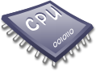
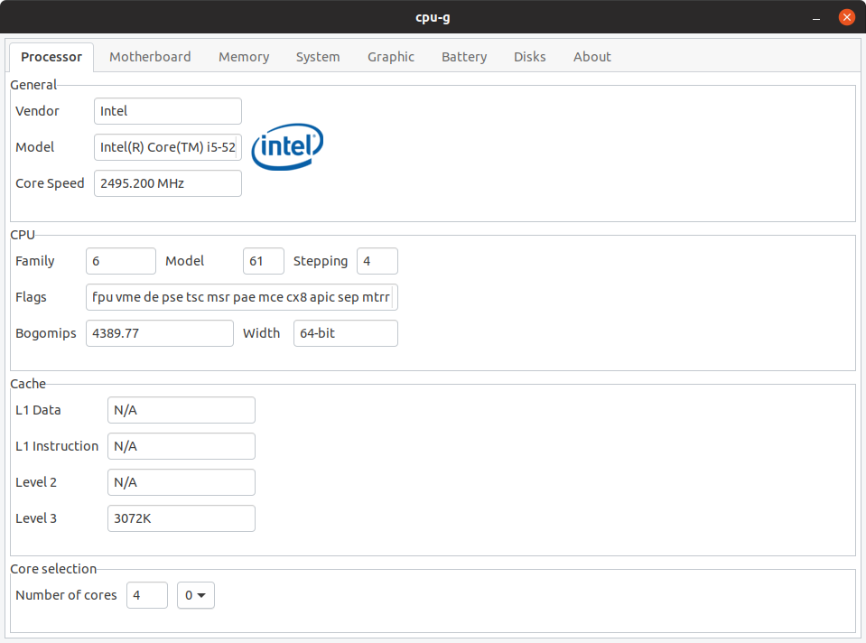
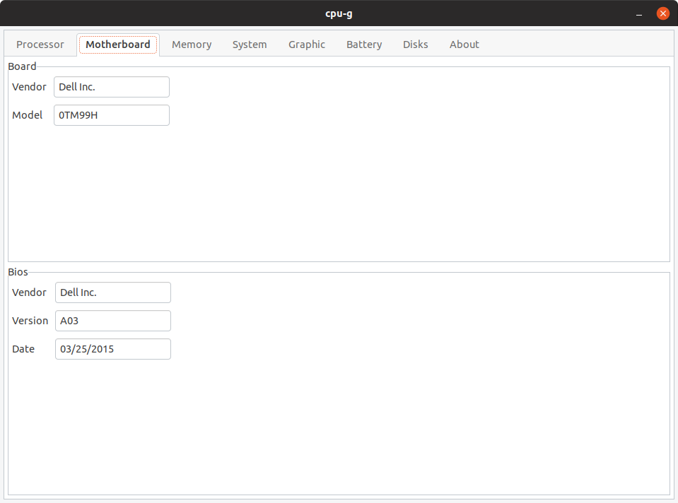
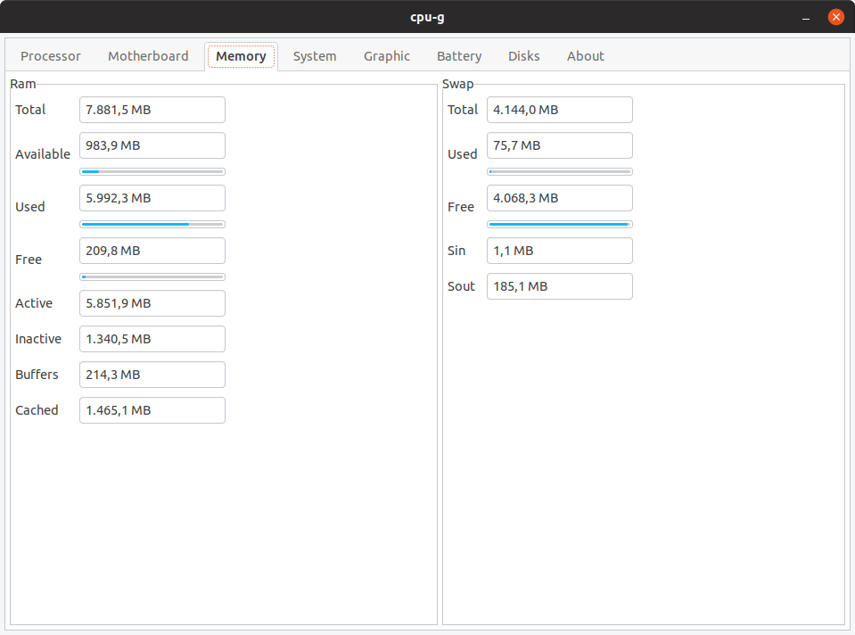
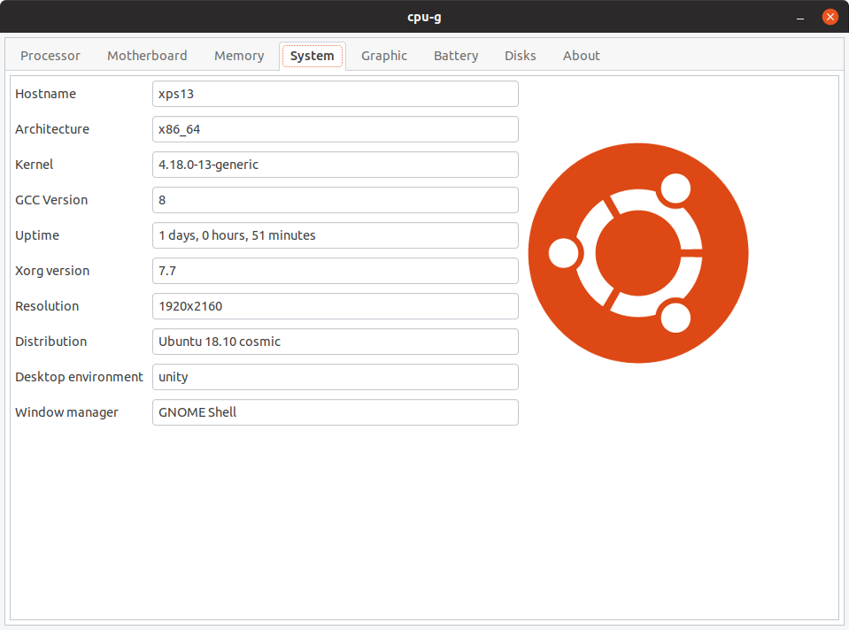
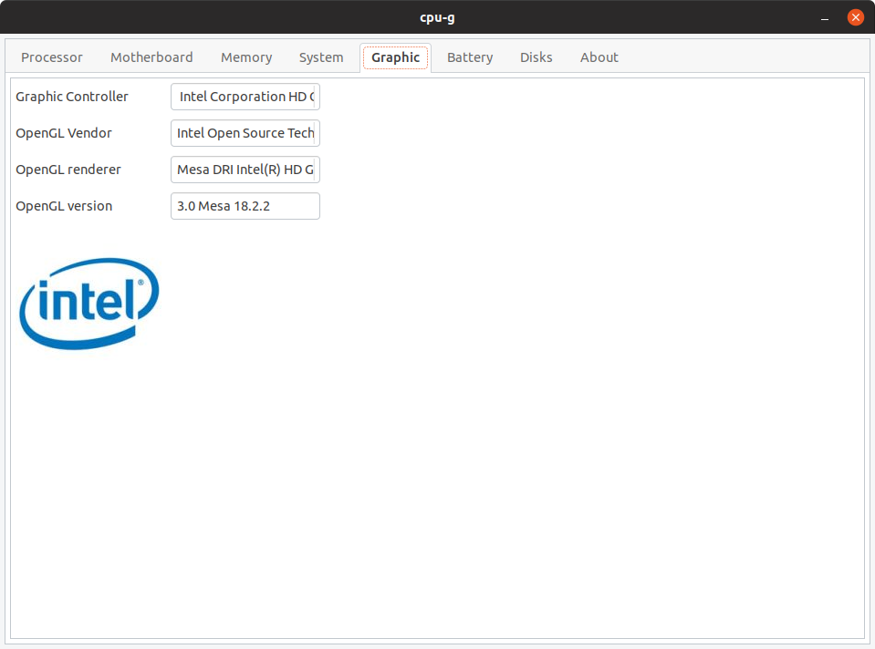
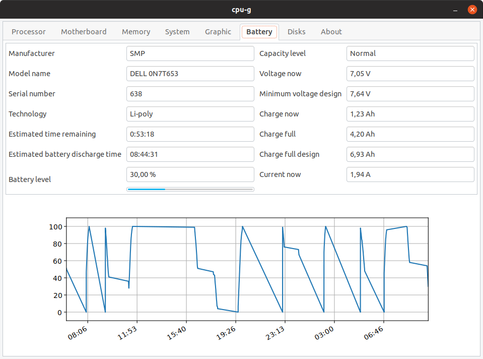
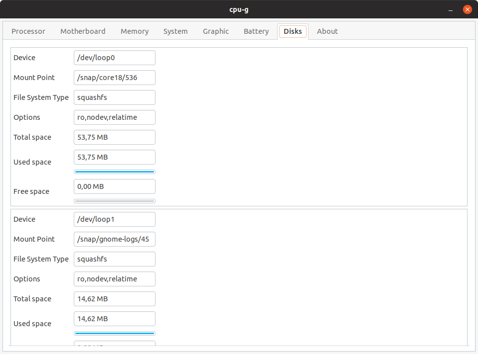
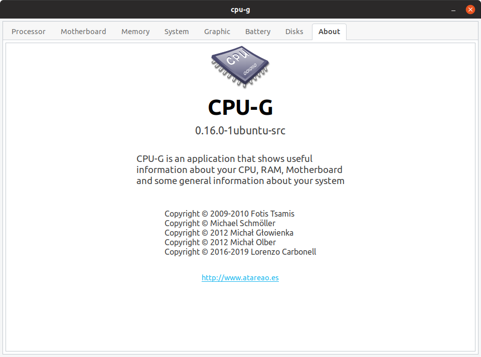

# CPU-G





**CPU-G** is a **Python 3** and **GTK+3** application that shows some useful information about your hardware.

It collects and displays information about your CPU, RAM, Motherboard, some general information about your system and more.

More info: [cpu-g](https://www.atareao.es/aplicacion/cpu-g-donde-ver-hardware-instalado/)

## Install

To install CPU-G run following commands in a terminal (`Ctrl+Alt+T`),

```
sudo add-apt-repository ppa:atareao/atareao
sudo apt update
sudo apt install cpu-g
```

Before running CPU-G install the dependencies.

```
sudo apt install libgirepository1.0-dev gcc libcairo2-dev pkg-config python3-dev gir1.2-gtk-3.0
pip3 install pycairo PyGObject psutil dbus-python matplotlib
```

## Credits

* Copyright © 2009-2010 Fotis Tsamis
* Copyright © Michael Schmöller
* Copyright © 2012 Michał Głowienka
* Copyright © 2012 Michał Olber
* Copyright © 2016-2019 Lorenzo Carbonell

## Screenshots

### Processor



### Motherboard



### Memory



### System



### Graphic



### Battery



### Disks



### About


