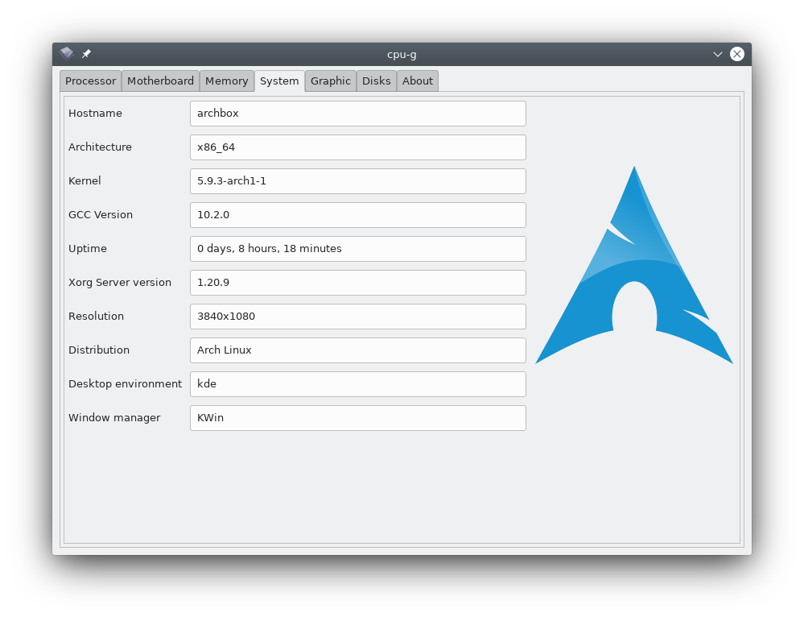

# CPU-G


**CPU-G** is a **Python 3** and **GTK+3** application that shows some useful information about your hardware.

It collects and displays information about your CPU, RAM, Motherboard, some general information about your system and more.

## Screenshots

### Processor


### Motherboard


### Memory


### System



### Graphic


### Battery


### Discs


### About


## Install

To install CPU-G run following commands in a terminal (`Ctrl+Alt+T`),

```
sudo add-apt-repository ppa:atareao\atareao
sudo apt update
sudo apt install cpu-g
```

## Credits

Copyright © 2009  Fotis Tsamis <ftsamis@gmail.com>.
Copyright © 2016-2019  Lorenzo Carbonell (aka atareao) <lorenzo.carbonell.cerezo@gmail.com>

Site: http://cpug.sourceforge.net/
